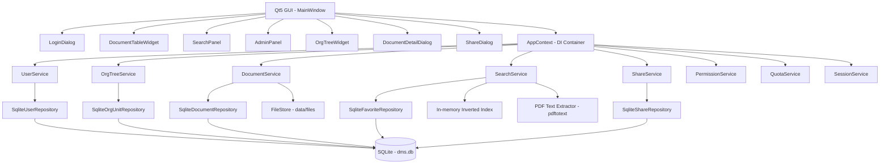

# Project plan: Hierarchical Document Management System in C++

## 1. Problem understanding

Build a document management system for an organization with a tree-shaped unit hierarchy.

Core ideas:
- Each user belongs to exactly one organizational unit.
- Units are organized in a parent-child tree.
- Access rights depend on both role and organizational position.
- Documents exist in personal space and unit public space.
- Public documents of a parent unit are visible to all descendant units.

## 2. Actual implementation (completed)

The project was implemented as a **C++17 Qt5 desktop GUI application** with **SQLite persistence**.

### Technology stack
- C++17, CMake
- Qt5 Widgets (Fusion style)
- SQLite3 (WAL mode, foreign keys, prepared statements)
- poppler-utils (pdftoppm, pdftotext, pdfinfo) for PDF preview and text extraction
- FNV-1a hashing for password storage

### Architecture layers
1. **Domain layer** — entities and enums (User, OrgUnit, Document, ShareRecord, FavoriteRecord)
2. **Repository layer** — abstract interfaces + SQLite implementations
3. **Service layer** — business logic (OrgTree, User, Permission, Document, Share, Search, Session, Quota)
4. **API/Context layer** — AppContext (DI container) + shared seed data
5. **GUI layer** — Qt5 Widgets desktop application
6. **Storage layer** — FileStore for document file content

## 3. MVP scope (all completed)

### Implemented features
1. System admin
   - Manage organization tree (create/delete units)
   - Manage users (create/delete, assign roles, set quota)
   - Full read access to all documents including Personal

2. Normal user
   - Upload, edit, delete personal documents
   - Mark favorite documents
   - Search by name or content (including PDF text extraction)
   - Share document to another user (READ or EDIT permission)

3. Unit admin
   - Upload documents to unit public space
   - Public documents propagate visibility to descendant units

4. Additional features
   - PDF preview (all pages rendered via pdftoppm)
   - PDF text extraction for search indexing
   - Storage quota per user with enforcement
   - Alphabetically sorted org tree
   - Toolbar tab highlighting for active panel

## 4. Architecture (as built)

### Logical layers
1. **GUI layer** (`src/gui/`)
   - Qt5 Widgets: MainWindow, LoginDialog, AdminPanel, DocumentTableWidget, SearchPanel, OrgTreeWidget, DocumentDetailDialog, ShareDialog
   - PDF rendering via QProcess calling poppler-utils
2. **Application service layer** (`src/services/`)
   - Use-case orchestration: OrgTreeService, UserService, DocumentService, PermissionService, SearchService, ShareService, QuotaService, SessionService
3. **Domain layer** (`src/domain/`)
   - Users, units, documents, permissions, sharing rules
4. **Infrastructure layer**
   - SQLite persistence (`src/repositories/sqlite/`)
   - File storage (`src/storage/`)
   - Search index (in-memory inverted index, rebuilt on startup)
   - Utilities: IdGenerator, Hash, Tokenizer

### Main architectural style
A modular monolith with clear separation of concerns:
- Repository interfaces allow swapping implementations (memory → SQLite done)
- Services depend on abstractions, not concrete implementations
- AppContext serves as a lightweight DI container

## 5. High-level component model



## 6. Domain model

### Main entities
- `OrgUnit`
  - `id`
  - `name`
  - `parentUnitId`
  - `childrenIds`

- `User`
  - `id`
  - `username`
  - `passwordHash`
  - `role`
  - `unitId`
  - `quotaLimit`
  - `quotaUsed`

- `Document`
  - `id`
  - `ownerUserId`
  - `unitScopeId` for public unit docs
  - `visibilityType` personal or unit_public or direct_share
  - `title`
  - `contentPath`
  - `contentType`
  - `size`
  - `createdAt`
  - `updatedAt`
  - `isDeleted`

- `ShareRecord`
  - `documentId`
  - `fromUserId`
  - `toUserId`
  - `permission` read or edit

- `FavoriteRecord`
  - `userId`
  - `documentId`

### Enums
- `Role`
  - `USER`
  - `UNIT_ADMIN`
  - `SYS_ADMIN`

- `VisibilityType`
  - `PERSONAL`
  - `UNIT_PUBLIC`
  - `DIRECT_SHARE`

## 7. Permission model

This is the heart of the project and should be a defense focus.

### Core access rules
1. `SYS_ADMIN`
   - Full access to organization structure and users
   - Can inspect all metadata and read all documents (including Personal)

2. `UNIT_ADMIN`
   - Can manage unit public documents for their own unit
   - Can view propagated public docs from ancestor units through normal visibility rules
   - Should not automatically control sibling units

3. `USER`
   - Full control over own personal documents
   - Can access documents shared directly to them
   - Can read public unit documents from their unit and ancestor units

### Tree-based visibility rule
If a document is uploaded to public space of unit `U`, then any user belonging to:
- unit `U`
- any descendant of `U`
can read it.

This requires:
- efficient ancestor-descendant checking
- tree traversal utilities

### Implementation
[`PermissionService::explainReadAccess()`](src/services/permission_service.cpp) returns one of:
- `OWNER` — user owns the document
- `SHARED` — document explicitly shared to user
- `UNIT_PUBLIC` — document is public in user's unit or ancestor unit
- `SYS_ADMIN` — user is system admin
- `DENIED` — no access

## 8. Data structures

### Organization tree
- SQLite table `org_units` with `id`, `name`, `parent_id`
- Children populated via query: `SELECT id FROM org_units WHERE parent_id = ? ORDER BY name`
- Tree traversal via DFS in OrgTreeService

### Document storage
- Metadata in SQLite `documents` table
- File content in `data/files/` directory via FileStore
- Search index rebuilt in-memory on startup from document metadata + extracted text

### Search index
- In-memory inverted index: `unordered_map<string, unordered_set<DocumentId>>`
- PDF text extracted via pdftotext (poppler-utils)
- Non-PDF binary files skipped for content indexing
- AND-logic for multi-word queries

## 9. Module breakdown (as built)

### Core folders
- [`src/domain/`](src/domain/)
  - entities and enums
- [`src/services/`](src/services/)
  - business logic
- [`src/repositories/`](src/repositories/)
  - interfaces and SQLite implementations
- [`src/storage/`](src/storage/)
  - file persistence
- [`src/api/`](src/api/)
  - AppContext DI container + shared seed data
- [`src/gui/`](src/gui/)
  - Qt5 Widgets GUI
- [`src/utils/`](src/utils/)
  - ids, hashing, tokenizer
- [`tests/`](tests/)
  - smoke tests (22 scenarios)

### Important classes
- `OrgTreeService`
- `UserService`
- `DocumentService`
- `PermissionService`
- `SearchService`
- `ShareService`
- `QuotaService`
- `SessionService`

## 10. Actual source tree

```text
project/
  CMakeLists.txt
  PROJECT_STATE.md
  README.md
  demo_script.txt
  src/
    api/
      app_context.hpp
      seed_data.hpp
      seed_data.cpp
    domain/
      user.hpp
      org_unit.hpp
      document.hpp
      share_record.hpp
      favorite_record.hpp
      enums.hpp
      enums.cpp
    services/
      user_service.hpp / .cpp
      org_tree_service.hpp / .cpp
      permission_service.hpp / .cpp
      document_service.hpp / .cpp
      search_service.hpp / .cpp
      share_service.hpp / .cpp
      quota_service.hpp / .cpp
      session_service.hpp / .cpp
    repositories/
      interfaces/
        i_user_repository.hpp
        i_org_unit_repository.hpp
        i_document_repository.hpp
        i_share_repository.hpp
        i_favorite_repository.hpp
      sqlite/
        sqlite_database.hpp / .cpp
        sqlite_user_repository.hpp / .cpp
        sqlite_org_unit_repository.hpp / .cpp
        sqlite_document_repository.hpp / .cpp
        sqlite_share_repository.hpp / .cpp
        sqlite_favorite_repository.hpp / .cpp
    gui/
      main_gui.cpp
      login_dialog.hpp / .cpp
      main_window.hpp / .cpp
      org_tree_widget.hpp / .cpp
      document_table_widget.hpp / .cpp
      document_detail_dialog.hpp / .cpp
      search_panel.hpp / .cpp
      admin_panel.hpp / .cpp
      share_dialog.hpp / .cpp
      pdf_renderer.hpp / .cpp
      pdf_text_extractor.hpp / .cpp
    storage/
      file_store.hpp / .cpp
    utils/
      tokenizer.hpp / .cpp
      id_generator.hpp / .cpp
      hash.hpp / .cpp
  data/
    files/
  tests/
    CMakeLists.txt
    smoke_test.cpp
  plans/
    project_plan.md
    qt_gui_plan.md
```

## 11. Technology choices (final)

- C++17
- CMake
- SQLite3 for metadata persistence (WAL mode, foreign keys)
- Qt5 Widgets for GUI (Fusion style)
- poppler-utils for PDF processing (pdftoppm, pdftotext, pdfinfo)
- FNV-1a hashing for password storage
- FileStore for document file content on disk

## 12. Persistence strategy

- Document binary/text files stored under `data/files/`
- All metadata stored in SQLite database (`dms.db`)
- Search index rebuilt in-memory on startup from SQLite data + extracted PDF text
- Database seeded with demo data only when freshly created (`isNewDatabase()` check)

## 13. Search design

- Search title using substring match (case-insensitive)
- Search content using inverted index with AND-logic for multi-word queries
- PDF text extracted via pdftotext callback registered before indexing
- Non-PDF binary files skipped for content indexing
- Tokenizer: lowercase, trim, split on whitespace/punctuation

## 14. Implementation order (completed)

1. Build domain models and enums
2. Build organization tree service
3. Build user management and role model
4. Build permission engine
5. Build document CRUD in personal space
6. Build unit public document propagation visibility
7. Build direct sharing
8. Build search by name and content
9. Add favorites
10. Add quota usage
11. Add in-memory repositories
12. Migrate to SQLite persistence
13. Build Qt5 GUI desktop application
14. Add PDF preview and text extraction
15. Polish GUI (toolbar highlighting, quota defaults, permission sync)
16. Cleanup: remove memory repos, remove CLI, extract shared seed data
17. Add tests and demo scripts

## 15. Demo scenario for defense

### Demo flow
1. Create organization tree
   - Headquarters
   - Division A
   - Team A1
   - Team A2

2. Create users
   - one system admin
   - one unit admin for Division A
   - one normal user in Team A1
   - one normal user in Team A2

3. Show admin functions
   - create unit
   - assign user role

4. Show unit public document rule
   - unit admin uploads public doc in Division A
   - users in Team A1 and Team A2 can view it
   - unrelated unit cannot

5. Show personal document functions
   - user uploads personal file
   - edit title or content
   - mark favorite
   - search it

6. Show sharing
   - user shares personal document to another specific user
   - recipient can read it

7. Show quota
   - upload files and display storage used

### Why this demo is strong
It directly proves:
- tree-based organization logic
- role-based authorization
- document lifecycle
- search and sharing
- optional value-added features

## 16. What was actually done

### Phase 1: clarify scope
- Decided Qt5 GUI instead of REST API
- Decided SQLite persistence instead of JSON
- Support text files + PDF with text extraction

### Phase 2: implement core engine
- Implemented entities
- Implemented tree traversal
- Implemented permission checks
- Implemented repository interfaces + SQLite implementations

### Phase 3: implement business features
- Personal document CRUD
- Unit public docs
- Sharing
- Search (title + content with PDF extraction)
- Favorites
- Quota

### Phase 4: build GUI
- Login dialog
- Main window with tabbed toolbar
- Org tree navigation
- Document table with upload/delete/favorite/share
- Document detail with PDF preview
- Search panel
- Admin panel for user/unit management

### Phase 5: polish for defense
- Seed sample data (shared seed_data module)
- Smoke tests (22 scenarios)
- Cleanup redundant code (memory repos, CLI)
- Documentation (PROJECT_STATE.md, README.md)

## 17. Extensions with novelty and value

### Extension 1: inherited access visualization
Display why a user can see a document:
- own document
- shared document
- public from ancestor unit

Value:
- improves transparency
- useful for enterprise audit and user trust

### Extension 2: audit log
Record:
- who uploaded
- who viewed
- who shared
- who deleted

Value:
- aligns with enterprise compliance needs
- strong real-world relevance

### Extension 3: document classification
Tags such as:
- internal
- confidential
- public-unit

Then add policy restrictions by role.

Value:
- stronger security story
- more realistic enterprise system

### Extension 4: quota warning and cleanup suggestion
Warn users when storage usage crosses threshold.

Value:
- operational efficiency
- resource governance

### Extension 5: descendant cache
Precompute subtree membership for faster permission checks.

Value:
- performance optimization angle
- good for system-programming discussion

## 18. Newness and business value angles

### Newness
The novelty is not that document storage exists, but that your system combines:
- hierarchical organization tree
- inherited visibility across descendant units
- role-based control plus structural access rules
- transparent sharing and searchable storage
- SQLite persistence with clean repository abstraction
- Qt5 desktop GUI with PDF preview

### Business value
Compared with generic file storage:
- access matches enterprise structure naturally
- reduces manual sharing overhead
- avoids duplicated documents across child units
- improves governance and traceability
- enables controlled internal knowledge distribution

### Sector-specific value angle
If adapted to a telecom or large enterprise context:
- units can represent departments, centers, projects, or regional branches
- parent-level policy documents automatically flow to sub-units
- local units keep private operational documents separated
- easier internal collaboration without exposing all documents globally

## 19. Defense slide focus

Suggested 6-slide structure:
1. Problem and motivation
2. Requirement summary
3. Architecture and core modules
4. Permission model on organization tree
5. Demo scenarios and achieved results
6. Newness and business value

## 20. Risks and mitigation

### Risk
Permission logic becomes messy.
### Mitigation
Centralize all rules inside `PermissionService`.

### Risk
Content search across binary files is hard.
### Mitigation
Search content only for text-based documents; extract PDF text via pdftotext; skip non-PDF binaries.

### Risk
Database corruption during development.
### Mitigation
SQLite WAL mode; database auto-created with schema on first run; seed data only when DB is new.

## 21. Final scope achieved

Implemented with high quality:
- organization tree
- role-based permission engine
- personal document CRUD
- unit public inherited visibility
- direct share
- search title and text content (including PDF)
- quota tracking
- SQLite persistence
- Qt5 GUI desktop application
- PDF preview
- clean demo with 22 passing smoke tests
