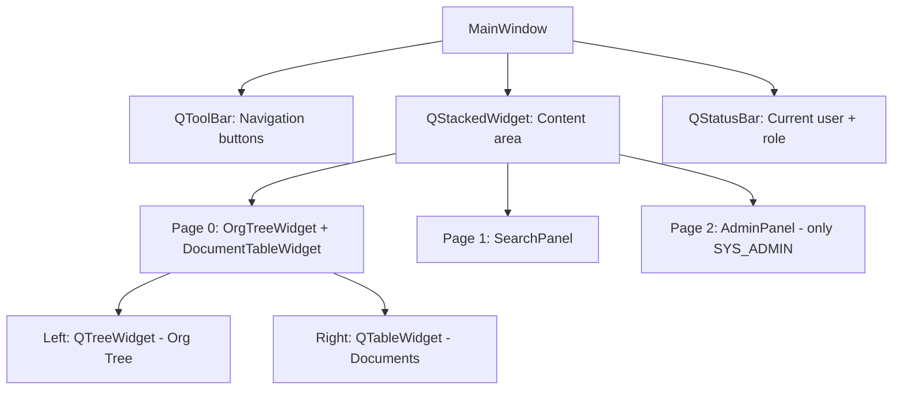
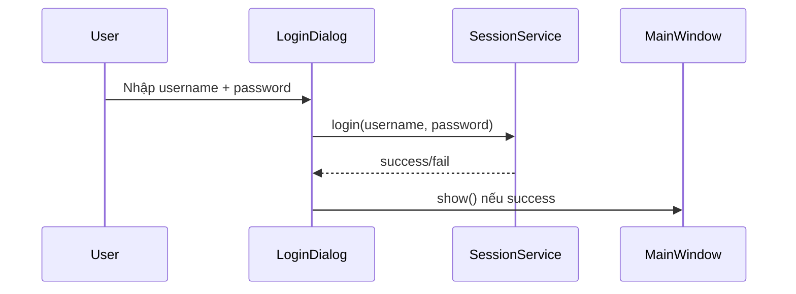
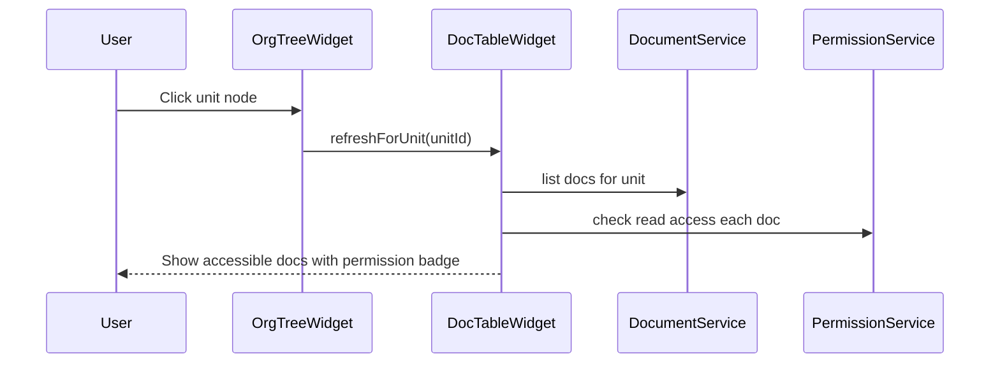

# Qt GUI Plan - Hierarchical Document Management System

## 1. Tổng quan kiến trúc

Qt GUI sẽ là một **executable riêng** (`docmanager_gui`) link trực tiếp vào `dms_core` static library.
Không cần REST API hay network layer — GUI gọi thẳng các service qua `AppContext`.

```
┌─────────────────────────────────────────────┐
│              docmanager_gui                  │
│  ┌─────────────────────────────────────┐    │
│  │         Qt Widgets Layer            │    │
│  │  LoginDialog | MainWindow | Dialogs │    │
│  └──────────────┬──────────────────────┘    │
│                 │ gọi trực tiếp             │
│  ┌──────────────▼──────────────────────┐    │
│  │         AppContext (DI Container)    │    │
│  │  orgTree | users | perms | docs ... │    │
│  └──────────────┬──────────────────────┘    │
│                 │                            │
│  ┌──────────────▼──────────────────────┐    │
│  │   dms_core static library           │    │
│  │   domain + repos + services         │    │
│  └─────────────────────────────────────┘    │
└─────────────────────────────────────────────┘
```

## 2. Qt Modules cần dùng

| Module | Mục đích |
|--------|----------|
| Qt5::Widgets | Toàn bộ UI controls |
| Qt5::Core | QString, QObject, signals/slots |

Chỉ cần 2 module cơ bản, không cần Qt Network, Qt SQL hay Qt Quick.

## 3. Cài đặt dependencies

```bash
# Ubuntu/Debian
sudo apt install qtbase5-dev qt5-qmake

# Fedora
sudo dnf install qt5-qtbase-devel

# Arch
sudo pacman -S qt5-base
```

## 4. Cấu trúc thư mục

```
src/gui/
├── main_gui.cpp           # QApplication + AppContext + seedDemo
├── main_window.hpp/cpp    # QMainWindow: toolbar, stacked widget, status bar
├── login_dialog.hpp/cpp   # Modal login dialog
├── org_tree_widget.hpp/cpp    # QTreeWidget hiển thị org hierarchy
├── document_table_widget.hpp/cpp  # QTableWidget hiển thị documents
├── document_detail_dialog.hpp/cpp # Upload/view/edit document
├── share_dialog.hpp/cpp   # Share document to another user
├── search_panel.hpp/cpp   # Search bar + result list
└── admin_panel.hpp/cpp    # User management, unit management
```

## 5. UI Layout - MainWindow



### MainWindow chi tiết:
- **Toolbar**: Buttons [Documents] [Search] [Admin] [Logout]
- **Content**: QSplitter hoặc QStackedWidget
- **Status bar**: Hiển thị "Logged in as: alice (SYS_ADMIN) | Unit: VDT Corp"

## 6. Luồng hoạt động chính

### 6.1 Login Flow


### 6.2 Document Management Flow


## 7. Chi tiết từng Widget

### 7.1 LoginDialog
- 2 QLineEdit: username, password (echo mode: Password)
- QPushButton: Login
- QLabel: Error message
- Modal dialog, block cho đến khi login thành công hoặc cancel

### 7.2 MainWindow
- QMainWindow with QToolBar
- Navigation: Home (org tree + docs), Search, Admin (conditional)
- Holds reference to AppContext
- After login: populate org tree, show docs of users unit

### 7.3 OrgTreeWidget
- QTreeWidget hiển thị cây tổ chức
- Mỗi node: icon + unit name
- Click node -> emit signal `unitSelected(QString unitId)`
- Double-click -> expand/collapse children
- Data source: `OrgTreeService::getTree()`

### 7.4 DocumentTableWidget
- QTableWidget với columns: Title | Owner | Visibility | Size | Created | Permission
- Permission column hiển thị badge (OWNER/SHARED/UNIT_PUBLIC/SYS_ADMIN)
- Context menu: View, Edit, Share, Delete, Add to Favorites
- Filter: My Docs | Unit Docs | Shared With Me | Favorites
- Upload button ở toolbar

### 7.5 DocumentDetailDialog
- Hiển thị: title, owner, visibility, content preview (text)
- Edit mode: cho phép sửa title, visibility, content
- Upload mode: QFileDialog chọn file, nhập title + visibility

### 7.6 ShareDialog
- Combo box chọn target user
- Radio buttons: READ / EDIT permission
- Show current shares for document
- Revoke button for existing shares

### 7.7 SearchPanel
- QLineEdit search bar
- Radio: Search by Title / Search by Content
- QListWidget results with doc title + unit + owner
- Double-click result -> open DocumentDetailDialog

### 7.8 AdminPanel (SYS_ADMIN only)
- Tab 1: User Management
  - Table: username, role, unit, quota used/limit
  - Actions: Create user, Change role, Set quota
- Tab 2: Unit Management
  - Tree view + Add unit, Rename, Move

## 8. CMake Integration

```cmake
# Thêm vào CMakeLists.txt gốc
find_package(Qt5 COMPONENTS Widgets REQUIRED)

set(CMAKE_AUTOMOC ON)
set(CMAKE_AUTORCC ON)
set(CMAKE_AUTOUIC ON)

file(GLOB GUI_SOURCES src/gui/*.cpp src/gui/*.hpp)

add_executable(docmanager_gui ${GUI_SOURCES})
target_link_libraries(docmanager_gui PRIVATE dms_core Qt5::Widgets)
target_include_directories(docmanager_gui PRIVATE ${CMAKE_SOURCE_DIR}/src)
```

Key points:
- `CMAKE_AUTOMOC ON` để Qt MOC tự xử lý Q_OBJECT macros
- GUI là executable riêng, CLI vẫn hoạt động độc lập
- Cả hai link cùng `dms_core`

## 9. Demo Scenarios cho bảo vệ

1. **Login** với nhiều tài khoản (alice/SYS_ADMIN, bob/USER, carol/UNIT_ADMIN)
2. **Org Tree Navigation**: Click qua các unit, thấy docs thay đổi
3. **Permission Demo**: 
   - alice thấy tất cả docs (SYS_ADMIN)
   - bob chỉ thấy docs của mình + shared + unit public
   - carol thấy docs trong unit mình quản lý
4. **Upload Document**: Tạo doc mới, chọn visibility
5. **Share**: Share doc từ alice cho bob, bob thấy doc xuất hiện
6. **Search**: Tìm kiếm theo title/content
7. **Admin**: alice tạo user mới, thay đổi role

## 10. Thứ tự implement

1. Cài Qt5 dev packages
2. Update CMakeLists.txt với Qt5 target
3. `main_gui.cpp` + `MainWindow` skeleton (build test)
4. `LoginDialog` (functional login)
5. `OrgTreeWidget` (hiển thị cây)
6. `DocumentTableWidget` (list docs với permission)
7. `DocumentDetailDialog` (view/upload)
8. `ShareDialog`
9. `SearchPanel`
10. `AdminPanel`
11. Polish: icons, status bar, error messages
12. Update README + demo walkthrough
